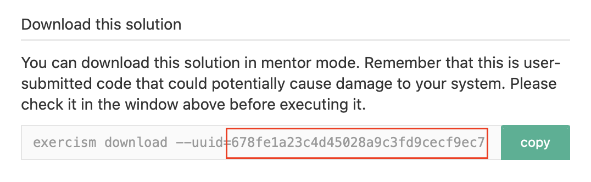

<p align="center"></p>

# Exercism Companion

This is a simple command line application to help Dart mentors.

## Installation

If you want to use Exercism Companion on the command line, install it using `pub global activate`:

```bash
$ pub global activate exercism-companion
```

To update Exercism Companion, use the same `pub global activate` command.

## Usage

Retrieve the UUID of the exercise you want to correct. You can find it under the `Download this solution` :



Then you can use Exercism Companion :

```bash
$ exercism-companion --uuid=<exercise uuid>
```

## Goals

- Help Dart Mentors give faster feedback
- Find if the exercise has tests passing or not
- Distributed as a pub package

## Issues and bugs

Please file reports on the [GitHub issue tracker](https://github.com/Corentin-Leffy/Exercism-Companion/issues).

## Contributing

Contributions welcome! Please read this [short guide](CONTRIBUTING.md) first.
